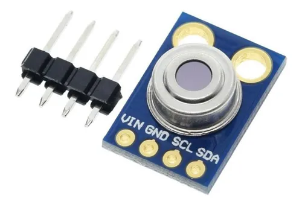
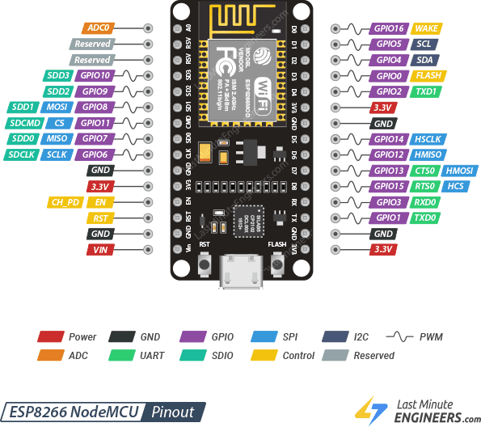

# CAMARA TERMICA

Este proyecto se basa en usar el modulo Mlx90614 para medir la radiacion termica en distintos puntos y con los datos obtenidos generar una imagen termica de X pixeles.
Desde el punto de vista fisico utilizaremos el efecto fotoelerctico y el efecto seebeck.

### Mlx90614
El Mlx90614 es un sensor piroelectrico que consta de 3 partes:
- Una capa cristalina que genera una carga electrica superficial cuando se expone al calor en forma de raciacion infrarroja.
- Una termopila que genera un voltaje el cual es proporcional a la potencia de la radiacion infrarroja incidente desde el objeto.
- Un termistor que se emplea para la compensacion de la temperatura ambiente.

A continuacion les dejamos el link a un video que explica en profundidad como funciona el sensor:  
https://youtu.be/uA3JK2_dL7o?si=DxVFuG80dL7nquLk

### Arduino Nano
EL microcontrolador que usaremos sera el Arduino Nano, lo programaremos usando C y implementaremos un script de Python para generar la imagen termica.

