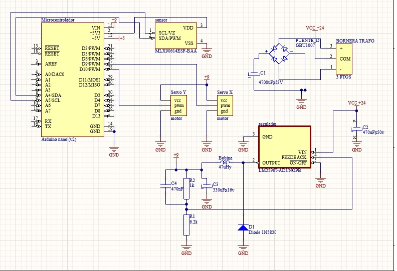

# CAMARA TÉRMICA

Este proyecto se basa en usar el modulo Mlx90640 para medir la radiación térmica en distintos puntos y con los datos obtenidos generar una matriz de imagen térmica con n pixeles.
Desde el punto de vista físico utilizaremos el efecto fotoeléctrico y el efecto seebeck.

## Sensor: Mlx90640
El Mlx90640 es un sensor de radiación que consta de 3 partes:
- Una capa cristalina que genera una carga electrica superficial cuando se expone al calor en forma de raciación infrarroja.
- Una termopila que genera un voltaje el cual es proporcional a la potencia de la radiación infrarroja incidente desde el objeto.
- Un termistor que se emplea para la compensación de la temperatura ambiente.

A continuación les dejamos el link a un video que explica en profundidad como funciona el sensor:  
https://youtu.be/uA3JK2_dL7o?si=DxVFuG80dL7nquLk

## Microcontrolador: Arduino Nano
EL microcontrolador que usamos sera el Arduino Nano, lo programamos usando C++ e implementamos un script de Python para generar la imagen térmica.

## Circuito propuesto:

